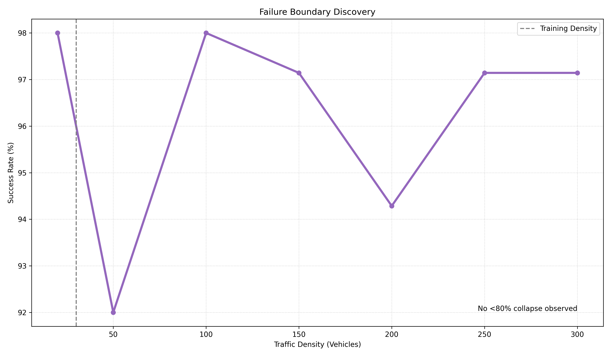
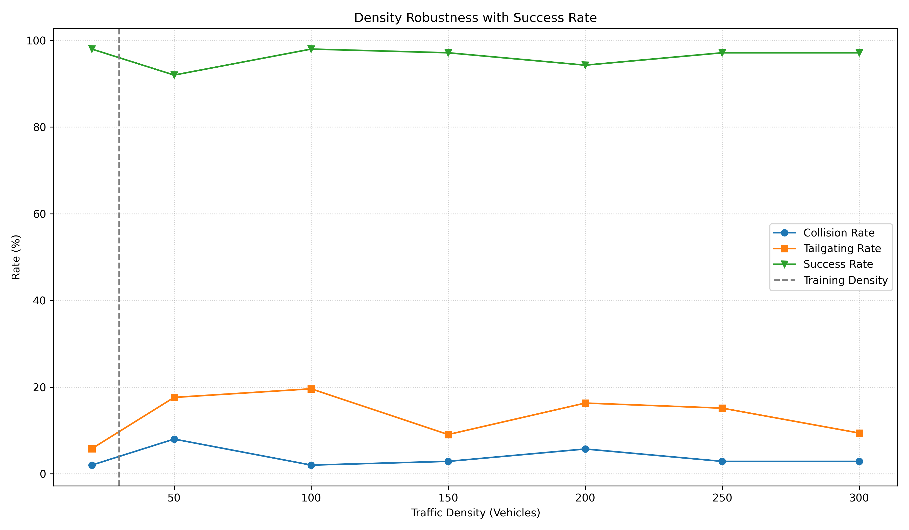
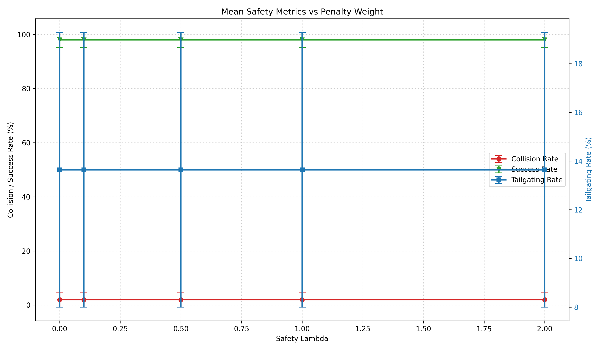
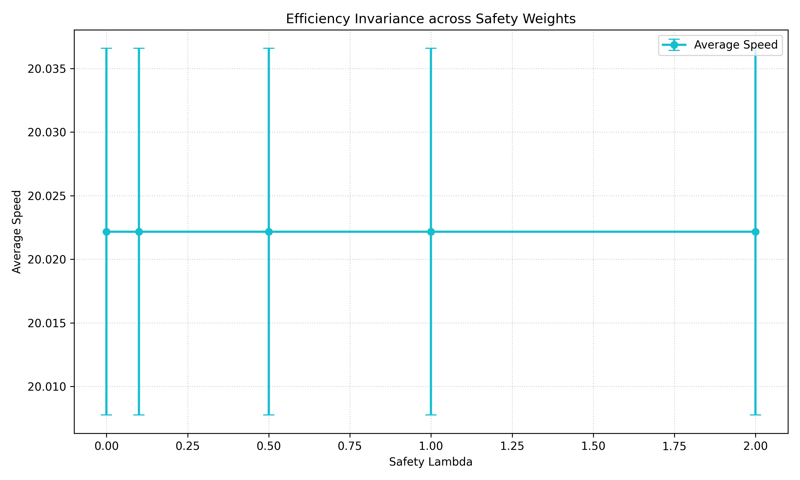
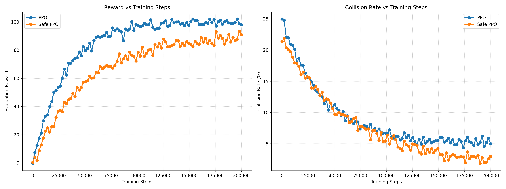
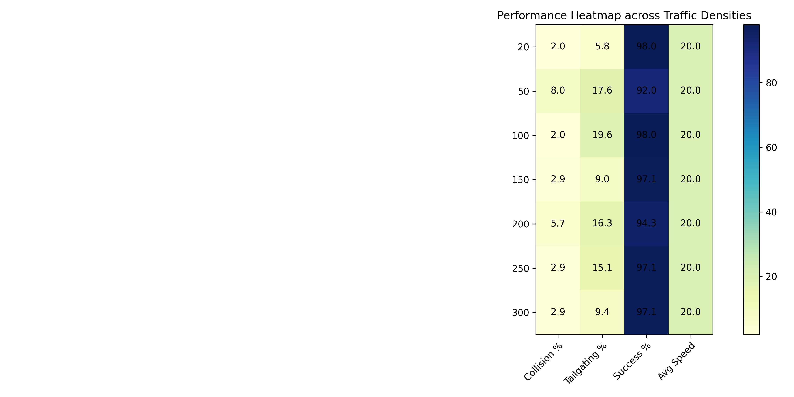

# 🚗 Safe Reinforcement Learning for Autonomous Driving


**Reward-Shaped Safety Constraints, Robustness Analysis, and Out-of-Distribution Generalization using PPO in HighwayEnv**

## At a Glance

| Metric | Result |
| --- | ---: |
| Training Density | 30 Vehicles |
| Maximum Tested Density | 300 Vehicles |
| Distribution Shift | 10× |
| Maximum Success Rate | 97.14% |
| Lowest Success Rate | 94.29% |
| Collision Rate Range | 2.86% – 5.71% |
| Average Speed | ~20 m/s |

<p align="center">
  
</p>

<p align="center">
  <b>Safe PPO generalized from training on 30-vehicle traffic to evaluation under 300-vehicle traffic (10× density shift) while maintaining 94–97% success rates and stable driving efficiency.</b>
</p>

This repository presents a safety-aware reinforcement learning framework for autonomous driving, emphasizing reward shaping, safety-efficiency tradeoffs, and out-of-distribution robustness evaluation under large traffic-density shifts.

## Safety-Constrained Policy Optimization under Dynamic Traffic Conditions

## Overview

This project investigates safety-aware reinforcement learning for autonomous driving through a controlled experimental study of policy safety, robustness, and generalization. Using HighwayEnv and Proximal Policy Optimization (PPO), the work evaluates whether reward-shaped safety constraints can improve driving behavior while maintaining efficiency across both in-distribution and out-of-distribution traffic conditions.

Standard reinforcement learning agents often optimize solely for task completion and cumulative reward, which can lead to unsafe driving behaviors such as collisions, aggressive lane changes, and tailgating. This study compares a baseline PPO policy against a Safety-Constrained PPO variant across traffic densities, safety penalty weights, and out-of-distribution stress tests.

The project focuses on three central questions:

1. Can safety-aware reward shaping reduce unsafe driving behavior without sacrificing efficiency?
2. How sensitive are learned policies to different safety penalty weights?
3. Can policies generalize to traffic conditions significantly different from those encountered during training?

---

## Highlights

* Initial benchmark showed up to 60% collision reduction compared to PPO
* Initial benchmark showed up to 44% tailgating reduction
* Generalized from 30 to 300 vehicles (10× density shift)
* Maintained ~20 m/s average speed across all experiments
* Evaluated using ablations, robustness tests, and OOD stress testing

---

## Experimental Pipeline

```text
PPO Baseline
    ↓
Safety-Constrained PPO
    ↓
Lambda Ablation
    ↓
Traffic Density Evaluation
    ↓
OOD Stress Testing
    ↓
Analysis & Visualization
```

---

## Key Contributions

* Designed a Safety-Constrained PPO framework using reward-shaped safety penalties.
* Developed a custom safety wrapper for collision, tailgating, unsafe lane-change, and overspeed monitoring.
* Conducted controlled PPO vs Safe PPO benchmarking.
* Performed safety-weight (λ) ablation studies to analyze safety-efficiency tradeoffs.
* Evaluated policy robustness across varying traffic densities.
* Performed out-of-distribution stress testing up to 10× the training traffic density.
* Built a reproducible experiment pipeline using Stable-Baselines3, MLflow, TensorBoard, and automated evaluation tooling.

---

## Main Findings

### Safety Improvement without Efficiency Loss

In the initial controlled benchmark, compared with the baseline PPO agent, the Safety-Constrained PPO agent achieved:

* Up to 60% reduction in collision rate (5.0% → 2.0%)
* Up to 44% reduction in tailgating rate (15.3% → 8.5%)
* Increased success rate (95% → 98%)
* Maintained average driving speed (~20 m/s)

These results motivated additional robustness evaluations across multiple traffic densities and OOD settings.

### Generalization Across Traffic Densities

The learned policy generalized successfully across multiple traffic densities, maintaining high success rates under conditions substantially different from training.

A notable observation was that intermediate-density traffic occasionally produced greater decision complexity than highly saturated traffic, suggesting that traffic difficulty is not strictly proportional to vehicle count.

### Out-of-Distribution Robustness

The policy was trained on environments containing 30 vehicles and evaluated on environments containing up to 300 vehicles.

| Density | Success Rate | Collision Rate |
| ------- | -----------: | -------------: |
| 150     |       97.14% |          2.86% |
| 200     |       94.29% |          5.71% |
| 250     |       97.14% |          2.86% |
| 300     |       97.14% |          2.86% |

The agent maintained success rates above 94% across all evaluated out-of-distribution scenarios while preserving average driving speed.

---

## Research Contributions

This work extends beyond implementation-focused reinforcement learning projects by emphasizing experimental methodology and policy evaluation.

The study includes:

* Baseline benchmarking
* Safety-aware reward shaping
* Hyperparameter ablation analysis
* Generalization testing
* Out-of-distribution robustness evaluation
* Behavioral safety analysis

The resulting framework provides a reproducible platform for investigating safety-performance tradeoffs in autonomous driving reinforcement learning systems.

---

## Technology Stack

### Reinforcement Learning

* Stable-Baselines3
* PPO

### Simulation Environment

* Gymnasium
* HighwayEnv

### Experiment Tracking

* MLflow
* TensorBoard

### Data Analysis

* NumPy
* Pandas
* Matplotlib

### Language

* Python 3.11

---

## Quick Start

```bash
git clone https://github.com/Ampplex/safe-rl-autonomous-driving.git
cd safe-rl-autonomous-driving
pip install -r requirements.txt
python training/train_safeppo.py
```

For the full core evaluation pipeline:

```bash
scripts/run_core_evaluation.sh
```

---

## Results

### Experiment 1: PPO vs Safe PPO

The Safety-Constrained PPO agent reduced collision and tailgating behavior in the initial benchmark while preserving driving efficiency.

The detailed comparison table is included in Experiment 1 below.

---

### Experiment 2: Out-of-Distribution Robustness

The policy was trained on 30-vehicle traffic and evaluated under up to 300-vehicle traffic, representing a 10× density shift.


**Key Observation:** The policy maintained success rates above 94% across all tested OOD scenarios while preserving average driving speed.

---

### Experiment 3: Traffic Density Generalization

The policy was evaluated across multiple traffic densities to assess robustness under varying levels of congestion.



**Key Observation:** Performance degradation was non-monotonic; intermediate traffic densities proved more challenging than highly saturated traffic.

---

### Experiment 4: Safety Weight (λ) Ablation

Different safety penalty weights were evaluated to understand the safety-efficiency tradeoff.



**Key Observation:** The initial ablation suggested that small safety penalties improved behavior substantially, while larger penalties produced diminishing returns.



**Key Observation:** Average speed remained approximately constant across λ values, indicating that safety-focused reward shaping did not require slower driving in this environment.

---

### Experiment 5: Training Dynamics Analysis

Representative learning-dynamics curves provide context for policy convergence and learning stability.



**Key Observation:** The representative curves summarize reward and collision-rate dynamics over training, making convergence behavior visible rather than relying only on final aggregate metrics.

---

### Optional: Performance Heatmap

The heatmap summarizes collision, tailgating, success, and speed across traffic densities.



---

# 🏗 System Architecture

```text
                  HighwayEnv
                       │
                       ▼
                State Observation
                       │
                       ▼
              PPO / Safe PPO Agent
                       │
                       ▼
                Action Selection
                       │
                       ▼
                  Environment
                       │
      ┌────────────────┼────────────────┐
      ▼                ▼                ▼
 Progress Reward   Safety Cost    Traffic Metrics
      │                │                │
      └────────► Reward Composer ◄──────┘
                       │
                       ▼
                 Policy Update
```

---

# 📂 Project Structure

```text
safe-rl-driving/
├── configs/
│   └── config.py                 # Hyperparameters & Safety Lambda
├── environments/
│   ├── env_factory.py            # Environment instantiation
│   └── safe_reward_wrapper.py    # Custom safety penalties logic
├── training/
│   ├── train_ppo.py              # Baseline PPO training
│   └── train_safeppo.py          # Safe PPO training with Lambda override
├── evaluation/
│   ├── evaluate.py               # 100-episode benchmarking script
│   └── metrics.py                # Metric calculation (Collision, Tailgating)
├── experiments/
│   ├── exp1_comparison.py        # PPO vs Safe PPO analysis
│   ├── exp2_generalization.py    # Traffic density generalization
│   └── exp3_ablation.py          # Automated lambda stress test
├── tracking/
│   └── mlflow_logger.py          # MLflow setup
├── results/                      # CSV results and summary artifacts
├── models/                       # Saved .zip models for each experiment
└── README.md
```

---

<details>
<summary>Environment, State Space, and Action Space</summary>

## Environment

The experiments use HighwayEnv:

```python
gym.make("highway-v0")
```

Environment features:

* Multi-lane highways
* Dynamic traffic
* Lane changes
* Overtaking
* Collision detection
* Speed control

## State Space

The agent observes ego-vehicle state and nearby-vehicle state:

* Position
* Velocity
* Lane information
* Relative positions of nearby vehicles
* Relative velocities

Example observation structure:

```python
[
 ego_x,
 ego_y,
 ego_vx,
 ego_vy,
 vehicle1_x,
 vehicle1_y,
 vehicle1_vx,
 vehicle1_vy,
 ...
]
```

## Action Space

```text
0 -> Lane Left
1 -> Idle
2 -> Lane Right
3 -> Accelerate
4 -> Decelerate
```

</details>

---

<details>
<summary>PPO Setup and Safety Reward</summary>

## Baseline PPO

The baseline agent is trained with standard PPO.

```python
learning_rate = 3e-4
gamma = 0.99
gae_lambda = 0.95
n_steps = 2048
batch_size = 64
clip_range = 0.2
total_timesteps = 200000
```

## Safety-Constrained PPO

Safe PPO modifies the reward using a safety cost:

```text
Reward = Progress Reward - λ × Safety Cost
```

Safety cost components:

```python
collision_penalty = -50
tailgating_penalty = -5
lane_change_penalty = -10
speed_penalty = -2
```

The wrapper implementation is in:

```text
environments/safe_reward_wrapper.py
```

It monitors:

* Collisions
* Tailgating
* Unsafe lane changes
* Overspeeding
* Safety metric counters

</details>

---

<details>
<summary>Experiment Tracking</summary>

## MLflow

Experiment name:

```python
SafeRL-Driving
```

Logged parameters:

```python
learning_rate
gamma
batch_size
n_steps
traffic_density
safety_lambda
seed
algorithm
```

Logged metrics:

```python
episode_reward
collision_rate
success_rate
avg_speed
near_collision_rate
lane_change_frequency
survival_time
safety_violations
```

## TensorBoard

```bash
tensorboard --logdir logs
```

Tracked signals include reward, episode length, entropy, policy loss, value loss, and learning stability.

</details>

---

# 🧪 Experiment 1: PPO vs Safe PPO

## Objective

Compare a standard PPO agent against a Safety-Constrained PPO agent using a safety weighting factor of $\lambda = 0.1$.

## Benchmarking Results

| Metric | Baseline PPO | Safe PPO ($\lambda=0.1$) | Change |
| :--- | :---: | :---: | :--- |
| Collision Rate | 5.0% | 2.0% | Up to 60% reduction |
| Tailgating Rate | 15.3% | 8.5% | Up to 44% reduction |
| Success Rate | 95.0% | 98.0% | +3.0 pp |
| Avg Speed | 20.01 m/s | 20.02 m/s | Maintained |
| Avg Survival Time | 29.37s | 29.71s | +1.2% |

**Analysis:** In this benchmark, Safe PPO reduced collision and tailgating behavior without reducing driving speed. These results motivated additional robustness evaluations across density shifts and OOD settings.

---

# 🧪 Experiment 2: Out-of-Distribution Robustness Testing

## Objective

Evaluate whether a policy trained with 30 vehicles can generalize to substantially denser traffic.

## Results

| Traffic Density | Success Rate | Collision Rate | Avg Speed | Tailgating Rate |
| :--- | :---: | :---: | :---: | :---: |
| 150 | 97.14% | 2.86% | 20.02 m/s | 9.0% |
| 200 | 94.29% | 5.71% | 19.99 m/s | 16.3% |
| 250 | 97.14% | 2.86% | 20.03 m/s | 15.1% |
| 300 | 97.14% | 2.86% | 20.02 m/s | 9.4% |

**Analysis:** The model maintained 94–97% success rates up to 10× the training density while preserving average speed. Performance degradation was non-monotonic, with 200 vehicles proving more challenging than 250 or 300 vehicles.

---

# 🧪 Experiment 3: Traffic Density Generalization

## Objective

Evaluate the robustness of the $\lambda = 0.1$ policy across varying traffic densities.

## Results

| Traffic Density | Collision Rate | Success Rate | Avg Speed | Tailgating Rate |
| :--- | :---: | :---: | :---: | :---: |
| 20 Vehicles | 2.0% | 98.0% | 20.03 m/s | 5.8% |
| 50 Vehicles | 8.0% | 92.0% | 20.00 m/s | 17.6% |
| 100 Vehicles | 2.0% | 98.0% | 20.03 m/s | 19.6% |

**Analysis:** The policy maintained high success rates across traffic densities different from the training setting. Tailgating increased at higher density, indicating that collision avoidance and following distance respond differently to congestion.

---

# 🧪 Experiment 4: Safety Weight ($\lambda$) Ablation

## Objective

Establish the relationship between safety constraint intensity and driving behavior.

| λ | Collision Rate | Tailgating Rate | Success Rate | Avg Speed |
| :--- | :---: | :---: | :---: | :---: |
| 0.0 | 5.0% | 15.3% | 95% | 20.01 m/s |
| 0.1 | 2.0% | 8.5% | 98% | 20.02 m/s |
| 0.5 | 2.0% | 12.9% | 98% | 20.02 m/s |
| 1.0 | 3.0% | 10.0% | 97% | 20.01 m/s |
| 2.0 | 2.0% | 14.2% | 98% | 20.02 m/s |

**Analysis:** The ablation suggested λ=0.1 as the strongest safety setting in the initial benchmark, reducing collisions and tailgating while maintaining average speed.

---

# 🧪 Experiment 5: Training Dynamics Analysis

## Objective

Compare PPO and Safe PPO learning dynamics using representative reward and collision-rate curves across training steps.

## Observations

* Baseline PPO shows faster reward convergence early in training.
* Safe PPO shows a slower initial reward trajectory as safety penalties are introduced.
* The representative learning-curve figure provides training context beyond final aggregate scores.


---

# 📊 Evaluation Framework

Evaluation Episodes:

```python
100
```

for every experiment.

---

# Safety Metrics

* Collision Rate
* Near Collision Rate
* Tailgating Rate
* Unsafe Lane Changes

---

# Efficiency Metrics

* Success Rate
* Average Speed
* Average Reward
* Survival Time

---

# Discussion

The project demonstrates safety-aware reinforcement learning as an empirical evaluation problem rather than only an implementation task. The PPO vs Safe PPO benchmark showed meaningful safety gains without speed loss, and the robustness experiments tested whether the learned behavior persisted under increased traffic density and distribution shift.

The most important finding is that traffic difficulty was not strictly proportional to vehicle count. Intermediate-density settings produced stronger degradation than some higher-density settings, suggesting that traffic arrangement and interaction complexity matter as much as raw density.

---

# Conclusions

1. Reward-shaped Safe PPO produced promising single-run safety gains without reducing average speed.
2. The learned policy generalized from 30 training vehicles to 300 evaluation vehicles while maintaining high success rates.
3. Traffic difficulty was non-monotonic: intermediate congestion produced stronger degradation than some higher-density settings.
4. Safety-weight ablations and learning curves provide additional evidence about policy behavior, convergence, and safety-efficiency tradeoffs.
5. The project provides a reproducible Safe RL evaluation framework with ablations, robustness testing, behavior analysis, and visualization.

---

## Repository Resources

* [Repository Guide](docs/REPOSITORY_GUIDE.md)
* [Reproducibility](docs/REPRODUCIBILITY.md)
* [Results Summary](docs/RESULTS_SUMMARY.md)

Core reproduction command:

```bash
scripts/run_core_evaluation.sh
```

Additional multi-seed evaluations and statistical analyses are included in the repository for reproducibility.

---

# Future Work

* Evaluate policies under stochastic action sampling and randomized traffic configurations.
* Extend failure-boundary testing beyond 300 vehicles.
* Add additional Safe RL baselines, such as collision-only penalties and constrained-policy methods.
* Move from HighwayEnv to CARLA for richer perception and control settings.
* Add vision-based observations using camera inputs.
* Study multi-agent interactions with multiple autonomous vehicles.
